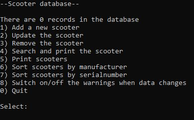

# Scooter Index

Erityyppisten potkulautojen datanhallintasovellus. Ohjelma hyödyntää modernin C++:an rakenteita. 

*Smart pointterit, muistinhallintaa, lambda-lausekkeet, staattinen data, singleton, observer*
 
